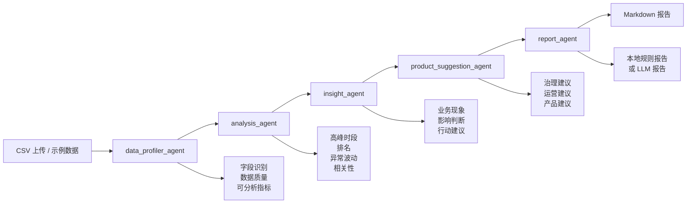

# mobility-insight-agent

`mobility-insight-agent` 是一个面向城市出行数据的 Streamlit + Agent 工作流 Demo。项目把 CSV 数据分析、业务洞察生成、产品建议输出和 Markdown 报告整合到一条可演示、可讲解、可复用的产品链路里，适合作为 AI 产品经理、数据产品经理和智慧交通产品岗位的作品集项目。

## 项目背景

城市交通和出行平台通常会同时面对拥堵、客流波动、异常事件和区域差异等问题，但数据分散在不同系统里，人工分析耗时，最终报告也往往不稳定、不可复用。这个项目希望把“上传数据 -> 识别字段 -> 分析指标 -> 业务洞察 -> 产品建议 -> 报告输出”做成一个完整的 AI 数据产品 Demo。

## 目标用户

- 交通管理部门
- 出行平台运营团队
- 智慧交通产品团队
- 数据分析师和数据产品经理

## 用户痛点

- 交通数据分散，字段命名不统一
- 人工清洗和分析耗时长
- 报告输出依赖个人经验，稳定性不够
- 洞察能看见数值，但很难直接转成行动建议

## 产品价值

- 从数据上传到洞察和建议，缩短分析与决策链路
- 用 Agent 工作流拆解复杂任务，让每一步都可解释、可展示
- 用结构化 Prompt 保证输出稳定，便于复用到不同 CSV 数据
- 让分析结果进一步转成交通治理、平台运营和数据产品建议

## 页面展示结构

页面当前按以下顺序组织：

1. 产品定位
2. Agent 工作流展示
3. Prompt 设计展示
4. 产品价值说明
5. 数据上传区
6. 数据概览区
7. 核心指标区
8. 图表分析区
9. AI 洞察报告区
10. 产品建议与价值判断区
11. 项目面试讲解稿

## Agent 工作流图



## Prompt 设计展示

项目在页面中展示了三类核心 Prompt 思路：

- `data_profiler_agent`：识别字段角色、数据质量和可分析指标，并输出结构化 JSON
- `analysis_agent`：分析趋势、排名、异常点、相关性、高峰时段和工作日/周末差异
- `insight / suggestion Prompt`：把数值结果翻译成现象、影响、建议和价值判断

## 产品建议类型

建议模块分成三类：

- 交通治理建议
- 出行平台运营建议
- 数据产品优化建议

每条建议都包含：

- 建议标题
- 用户角色
- 数据证据
- 价值判断
- 影响指标
- 优先级
- 实施复杂度

## 价值判断示例

- 拥堵时长
- 异常事件识别效率
- 报告生成时间
- 运营决策效率
- 用户等待时长
- 高峰运力匹配效率

## 核心功能

- CSV 上传和示例数据演示
- 字段类型自动识别
- 数据清洗与质量摘要
- 趋势分析、排名分析、异常点分析、相关性分析
- Plotly 图表展示
- 业务洞察生成
- 产品建议生成
- Markdown 报告导出
- 项目面试讲解稿展示

## 运行方式

```bash
cd mobility-insight-agent
python -m venv .venv
.venv\Scripts\activate
pip install -r requirements.txt
streamlit run app.py
```

## LLM 配置

项目支持可选的 LLM 报告生成，但不强依赖 OpenAI API Key。没有配置密钥时，`report_agent` 也可以使用本地规则生成 Markdown 报告。

`.env.example` 示例：

```env
OPENAI_API_KEY=your_api_key_here
OPENAI_MODEL=gpt-4o-mini
OPENAI_BASE_URL=
```

## Demo 截图占位

> 在这里放置 Streamlit 首屏、Agent 工作流、产品建议卡片和报告输出的组合截图。

## Demo 链接

- Demo 链接：`[待补充]`
- GitHub 链接：`[待补充]`

## 简历项目描述

城市出行洞察 Agent：基于 Streamlit 和多 Agent 工作流设计的城市交通数据产品，支持 CSV 上传、字段自动识别、数据清洗、趋势/排名/异常/相关性分析、业务洞察生成、产品建议输出与 Markdown 报告导出。项目重点展示了从数据分析到产品建议的完整链路设计，适用于交通治理、出行平台运营和智慧交通产品场景。

## 面试讲解稿

### 我为什么做这个项目

我希望把交通数据分析从“做表和写报告”升级成“可演示、可复用的 AI 数据产品”，让非技术用户也能快速理解分析结果并得到建议。

### 这个 Agent 解决了什么问题

它解决了交通数据分散、人工清洗耗时、分析结果难复用、洞察难落地的问题。

### Agent 工作流怎么设计

我把任务拆成 `data_profiler_agent`、`analysis_agent`、`insight_agent`、`product_suggestion_agent` 和 `report_agent`，让每一步输入输出都结构化，便于展示和追问。

### 为什么这个项目体现产品思维

因为我不仅做了分析逻辑，还定义了目标用户、核心指标、价值判断、建议优先级和作品集展示结构。

### 如果继续迭代，我会怎么做

下一步可以接入天气、节假日、施工和活动数据，并增加看板订阅、自动预警和更多行业模板化输出。

