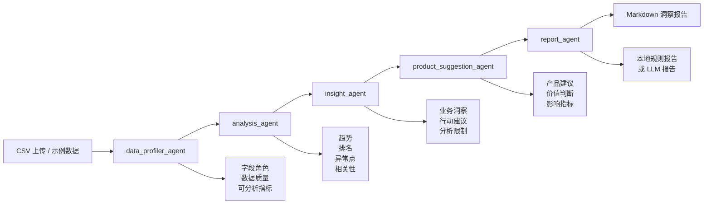

# mobility-insight-agent

`mobility-insight-agent` 是一个面向城市交通数据的 Streamlit + Agent 工作流项目。它从产品经理作品集角度展示：如何把原始 CSV 数据转化为可解释的交通分析、业务洞察、产品建议、价值判断和 Markdown 报告。

## 项目背景

城市交通治理和出行平台运营通常需要同时处理道路拥堵、客流波动、事故事件、区域差异和数据质量问题。传统分析流程依赖人工清洗数据、手动挑选指标、制作图表和撰写报告，既耗时，也难以稳定复用。

本项目将这个流程产品化：用户上传 CSV 后，多个 Agent 自动完成字段识别、数据清洗、趋势/异常/相关性分析、业务洞察生成、产品建议生成，并最终输出一份 Markdown 洞察报告。

## 目标用户

- 城市交通管理部门：关注拥堵治理、异常事件识别、区域治理优先级。
- 出行平台运营团队：关注高峰供需调度、用户等待时长、区域运营策略。
- 数据产品经理：关注数据接入质量、指标体系、自动化分析报告和决策看板。
- 数据分析师：希望快速从 CSV 数据中形成可复用的分析框架和报告草稿。

## 用户痛点

- 字段不标准：不同 CSV 的时间、区域、拥堵、客流、事故字段命名不一致。
- 数据处理慢：人工清洗、识别指标、做图和写报告耗费大量重复时间。
- 洞察难落地：图表能说明现象，但不一定能转化为治理或运营动作。
- 价值难表达：作品集或业务汇报中缺少“建议对应哪些指标改善”的价值判断。
- 报告不可复用：每次分析都从头写，缺少可自动化的 Agent 工作流。

## 产品目标

- 让非技术用户上传 CSV 后也能快速理解数据结构和可分析指标。
- 用 Agent 工作流拆解分析过程，让每一步输入输出都可解释、可展示。
- 将交通分析结果进一步转化为产品建议和价值判断。
- 缩短从数据上传到报告生成的时间，提升运营决策效率。

## 核心指标

- 字段识别准确率：自动识别时间列、区域列、数值列和业务指标的准确性。
- 数据质量问题发现时间：从上传数据到发现缺失、重复、不可分析字段的耗时。
- 异常事件识别效率：异常点检测对事故、拥堵突增、客流异常的发现效率。
- 报告生成时间：从 CSV 上传到 Markdown 报告产出的时间。
- 运营决策效率：从数据分析结果到可执行建议的转化效率。
- 拥堵时长：交通治理建议希望影响的核心结果指标。
- 用户等待时长：出行平台运营建议希望影响的体验指标。

## 产品价值

- 对交通治理：帮助识别高风险区域、异常事件和治理优先级。
- 对出行平台：辅助高峰运力调度、用户引导和区域运营策略。
- 对数据产品：沉淀字段识别、数据质量校验、指标体系和自动化报告能力。
- 对作品集展示：体现从用户痛点、指标体系、Agent 流程到价值判断的完整产品思维。

## Agent 工作流



## 作品集展示说明

建议将项目页面截图放在这里，作为作品集演示页封面位。

```text
Demo 截图占位：
[这里插入 Streamlit 首屏、产品建议卡片、报告输出的组合截图]
```

展示时建议依次说明：

1. 用户上传 CSV，系统自动识别字段。
2. 页面展示数据概览、核心指标和图表分析。
3. AI 洞察将分析结果翻译成业务语言。
4. 产品建议模块把洞察转成交通治理、平台运营和数据产品优化建议。
5. 报告模块输出可下载的 Markdown 文档，适合作品集演示和项目答辩。

## Agent 说明

### 1. `data_profiler_agent`

负责识别字段、数据质量和可分析指标。

结构化输出：

- `roles`：时间列、区域列、数值列、拥堵指标、客流指标、事故指标
- `quality_summary`：清洗前后行数、缺失值、移除记录数
- `analyzable_metrics`：可分析指标、语义角色、聚合方式、均值、最小值、最大值
- `column_profile`：字段预览表

### 2. `analysis_agent`

负责计算趋势、排名、异常点和相关性。

结构化输出：

- `kpis`：记录数、字段数、区域数、异常点数、核心业务指标
- `trend_table`：按日期聚合的趋势结果
- `ranking_table`：按区域聚合的排名结果
- `anomalies`：z-score 异常点检测结果
- `correlation_matrix`：数值指标相关性矩阵
- `correlation_pairs`：相关性最高的指标对

### 3. `insight_agent`

负责把分析结果转化为业务洞察。

结构化输出：

- `executive_summary`：执行摘要
- `insights`：洞察卡片，包含标题、证据、影响、优先级
- `recommendations`：行动建议
- `limitations`：分析限制

### 4. `product_suggestion_agent`

负责生成产品建议和价值判断。

建议分为三类：

- 交通治理建议：面向城市管理方，关注拥堵治理、异常事件响应和治理优先级。
- 出行平台运营建议：面向平台运营，关注供需调度、用户引导和运营日报。
- 数据产品优化建议：面向数据产品建设，关注字段识别、数据质量和外部变量接入。

每条建议包含：

- `recommendation`：产品建议
- `evidence`：来自分析结果的证据
- `value_judgement`：为什么值得做
- `impact_metrics`：影响指标
- `priority`：优先级
- `effort`：实施复杂度

### 5. `report_agent`

负责生成 Markdown 报告。未配置 LLM 时使用本地规则报告；配置 `OPENAI_API_KEY` 后可调用 LLM 生成报告。

## 产品建议与价值判断

| 分类 | 建议 | 价值判断 | 影响指标 |
| --- | --- | --- | --- |
| 交通治理建议 | 建立高风险区域分级治理清单 | 把趋势、排名和异常点转化为治理优先级，帮助管理方优先处理高影响区域 | 拥堵时长、高拥堵区域响应时间、治理任务闭环率 |
| 交通治理建议 | 建设异常事件复核与派单流程 | 将异常检测从事后看报表推进到近实时响应 | 异常事件识别效率、事件响应时长、人工复核准确率 |
| 出行平台运营建议 | 面向高峰区域做供需调度和用户引导 | 将分析结果连接到平台运营动作，降低高峰体验波动 | 用户等待时长、高峰客流承载率、运营决策效率 |
| 出行平台运营建议 | 自动生成运营日报和异常摘要 | 降低人工整理数据和撰写报告成本 | 报告生成时间、运营决策效率、跨团队同步成本 |
| 数据产品优化建议 | 沉淀字段语义识别与数据质量规则 | 提升数据接入一致性，减少分析前准备成本 | 字段识别准确率、数据质量问题发现时间、分析准备时间 |
| 数据产品优化建议 | 引入外部变量增强洞察解释力 | 提升异常解释能力和策略命中率 | 异常事件识别效率、洞察解释率、策略命中率 |

## 页面展示

Streamlit 页面会展示每一步 Agent 的输出，适合作为作品集演示：

- 顶部项目介绍
- 数据上传区
- 数据概览区
- 核心指标区
- 图表分析区
- AI 洞察报告区
- 产品建议与价值判断区
- 简历项目描述区

## 适合放进简历的项目描述

城市出行洞察 Agent：独立设计并实现面向城市交通数据的 Streamlit 数据产品，构建 `data_profiler`、`analysis`、`insight`、`product_suggestion`、`report` 多 Agent 工作流，支持 CSV 上传、字段自动识别、数据质量诊断、趋势/排名/异常/相关性分析，并将分析结果转化为交通治理、出行平台运营和数据产品优化建议，输出价值判断与 Markdown 报告，用于提升异常事件识别效率、报告生成效率和运营决策效率。

## 项目结构

```text
mobility-insight-agent/
├── app.py
├── style.py
├── requirements.txt
├── README.md
├── sample_data.csv
├── .env.example
└── src/
    ├── __init__.py
    ├── agents.py
    ├── data_processing.py
    └── visualization.py
```

## 快速开始

```bash
cd mobility-insight-agent
python -m venv .venv
.venv\Scripts\activate
pip install -r requirements.txt
streamlit run app.py
```

## LLM 配置

复制 `.env.example` 为 `.env`，并填写密钥：

```bash
copy .env.example .env
```

```env
OPENAI_API_KEY=your_api_key_here
OPENAI_MODEL=gpt-4o-mini
OPENAI_BASE_URL=
```

如果使用 OpenAI 兼容服务，可以填写 `OPENAI_BASE_URL`。如果没有配置 `OPENAI_API_KEY`，`report_agent` 会使用本地规则生成 Markdown 报告。

## CSV 数据建议

应用不会写死字段名，会结合字段名关键词和数据类型自动识别角色。推荐 CSV 中包含以下类型的字段：

- 时间类字段：日期、时间、timestamp、date 等
- 区域类字段：行政区、区域、路段、站点、district、region 等
- 数值类字段：拥堵指数、客流量、事故数、平均车速等

示例数据见 `sample_data.csv`。
